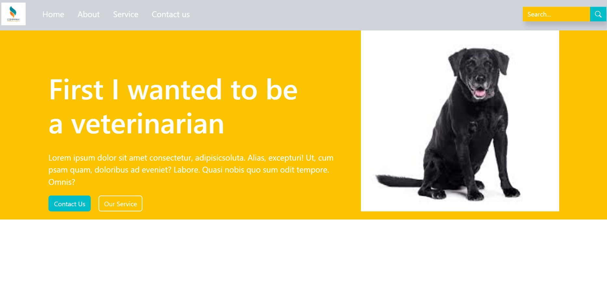
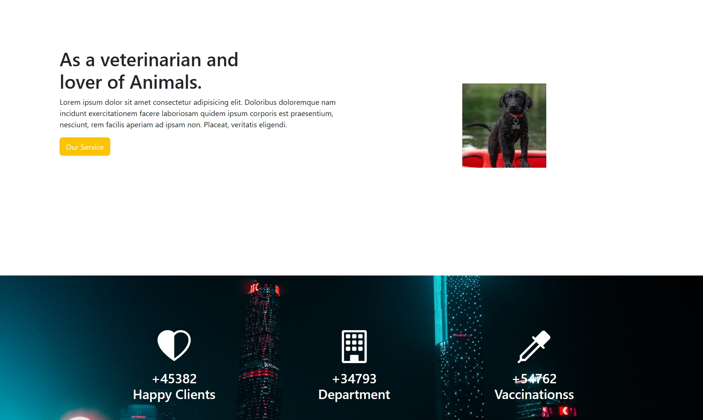
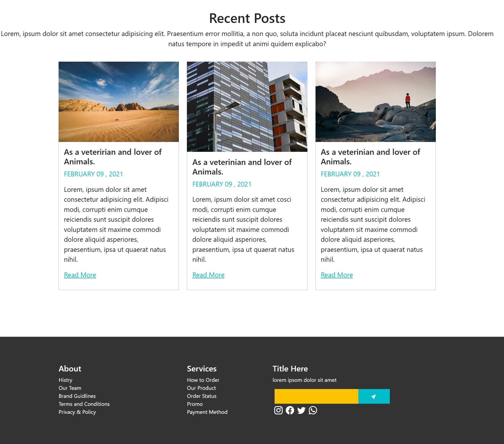
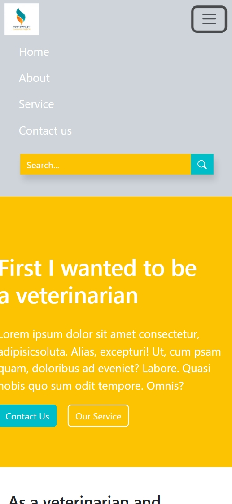

# 🎨 Bootstrap UI Project 2


A modern and responsive **UI Design Project** built using **Bootstrap, HTML5, and CSS3**, focused on creating visually appealing layouts and reusable UI components with a mobile-first approach.

---

## 🚀 Live Demo

🌐 **Live Website:** https://khushi-66.github.io/BootStrap-ui-2/

📂 **GitHub Repository:** https://github.com/khushi-66/BootStrap-ui-2

---

## 🎥 Live Preview


---

## 📌 Overview

This project showcases practical implementation of the **Bootstrap framework** to design clean, responsive, and structured UI layouts.

It demonstrates:

* Efficient use of Bootstrap components
* Grid system for layout design
* Responsive design principles
* Clean and maintainable UI structure

---

## 📸 Screenshots

### 🏠 Landing Section



### 🧩 UI Sections



### 📊 Layout Design



### 📱 Mobile View



---

## ✨ Features

* 📱 Fully responsive (mobile-first design)
* 🎨 Clean and modern UI
* 🧩 Reusable Bootstrap components
* ⚡ Fast and lightweight
* 🧭 Structured layout using grid system

---

## 🛠️ Tech Stack

| Technology      | Usage        |
| --------------- | ------------ |
| **HTML5**       | Structure    |
| **CSS3**        | Styling      |
| **Bootstrap**   | UI Framework |
| **Grid System** | Layout       |

---

## 🌐 Deployment

This project is deployed using **GitHub Pages**, making it publicly accessible.

### 🚀 Deployment Steps:

* Pushed project to GitHub repository
* Enabled **GitHub Pages** from repository settings
* Selected main branch for deployment
* Generated live URL for public access

---

## 📂 Project Structure

```bash
BootStrap-ui-2/
│── index.html
│── style.css
│── screenshots/
│── assets/
│── README.md
```

---

## ⚙️ Installation & Setup

### 1️⃣ Clone the repository

```bash
git clone https://github.com/khushi-66/BootStrap-ui-2.git
```

### 2️⃣ Navigate to project folder

```bash
cd BootStrap-ui-2
```

### 3️⃣ Open in browser

Simply open `index.html` in your browser 🚀

---

## 📈 Future Improvements

* 🎨 Add animations and transitions
* 🌙 Dark mode support
* 🧠 More advanced UI components
* 🔗 Backend/API integration

---

## 👩‍💻 Author

**Khushi Sahu**
🔗 https://github.com/khushi-66

---

## ⭐ Support

If you like this project, give it a ⭐ on GitHub!
